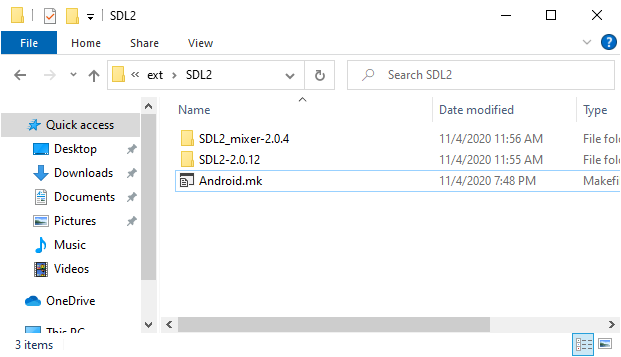

# Building Julius for Android

## 1. Getting the source files and the necessary dependencies

You have two options regarding on how to obtain the source code for Julius.
The simplest, but not recommended one, is [downloading the `julius` repository as a zip file](https://github.com/bvschaik/julius/archive/master.zip).

While doing this will work, you will have to download the entire source again if there are
any updates to the game which you wish to build yourself. So only directly download the
source if you're sure you want to do it just once.

Still, if you download the contents as a zip file, extract them to a folder, which will be
your `work folder`. You can now proceed to [getting SDL](#2-getting-the-sdl-source-files).

The best approach, however, is to use Git, since it allows you to keep up with
changes to the source code.

Git is a source control system, allowing the local source code to be updated by only downloading
the relevant changes instead of the entire codebase. This program is optional.

Installation and usage depends on whether you're on a Windows or *nix (Linux, Apple, etc) environment.

If using Windows, you can [download it from the `gitforwindows` website](https://gitforwindows.org),
which provides an user interface as well as the command line tools. The default installation
options are enough for Julius.

If using Linux or any other operating system, please refer to your own package manager. For example,
in order to install Git on Ubuntu or any Debian based system, you should type the following code:

    $ sudo apt install git

After installing Git, you can obtain the source code directly from the `bvschaik/julius` repository.

To do so, follow these steps (both for Windows and *nix):

1. Open a console window and navigate to the folder where you wish to download the source to.

2. On the command window, type:

        > git clone https://github.com/bvschaik/julius.git

**Optional:** If you already have the source files from Git and simply wish to update them
(in order to build a newer version), repeat above step 1. and then type:

        > git pull origin master

If you then wish to proceed building Julius, delete the `build` folder and proceed to
[build Julius](#3-building-julius) normally.

## 2. Getting the SDL source files

SDL is a dependency which Julius uses that makes window drawing and input handling work across all different platforms.

While there are binaries available for most platforms, for Android the source must be compiled and bundled alongside Julius.

Therefore, before building Julius, the SDL source must be made available for the compiler. To do so, follow these steps:

1. Download the `SDL2` source code:

	* Open the [SDL2 download page](https://www.libsdl.org/download-2.0.php)
    * In the section `Source Code`, select `SDL2-2.0.12.zip` (for Windows) or `SDL2-2.0.12.tar.gz` (for Linux)
    * Open the downloaded file
    * Extract its entire contents to the `<work folder>\ext\SDL2` folder

        **Note:** You should extract the compressed file's top level folder. So, for SDL 2.0.12, you should end up only with
                  the folder `SDL2-2.0.12` in the folder `<work folder>\ext\SDL2`

2. Download the `SDL2_mixer` development library as a zip file:

	* Open the [SDL2_mixer download page](https://www.libsdl.org/projects/SDL_mixer/)
    * In the section `Source`, select `SDL2_mixer-2.0.4.zip` (for Windows) or `SDL2_mixer-2.0.4.tar.gz` (for Linux)
    * Open the downloaded file
    * Extract its entire contents to the `<work folder>\ext\SDL2` folder

        **Note:** You should extract the compressed file's top level folder. So, for SDL Mixer 2.0.4, you should end up only with
                  the folder `SDL2_mixer-2.0.4` in the folder `<work folder>\ext\SDL2`

    Here's how your `<work folder>\ext\SDL2` should look at the end:

    

## 3. Building Julius

You have two options in how you want to build Julius. You can either:

* [Build using **Android Studio**](#a-using-android-studio) (the preferred way); or
* [**Use Gradle** from the command line](#b-using-gradle-via-command-line) (not recommended)

### A. Using Android Studio

1. Make sure you have [Android Studio](https://developer.android.com/studio) installed.
   Also, make sure you have the latest version of Android Studio. At the time of writing this guide, it was v4.1.

2. Open Android Studio. After the final steps of the installation are finished you'll be greeted with the following screen:

    

3. The first time you open Android Studio, you need to install a few dependencies in order for Julius to compile. To do so, go to the bottom right of the window and pick `Configure → SDK Manager`.

4. On the window that appears, select the  `SDK Tools`, then pick `NDK (Side by side)` and `CMake`. Click `Apply`. Accept the license agreements then click `OK` to install.

    

5. When the dependencies have been installed, click `OK` until you return to the initial screen displayed on step 2.

6. Select `Open an Existing Project`.

7. Navigate to your Julius project and select the `android` folder. You should pick `<work folder>\android`. Click `OK`.

8. The main Android Studio window will load and the project will be loaded.

    

9. The first time you open the project on Android Studio, it will automatically download all the remaining required dependencies and index the files. Please allow it some time to do so.

10. After files have been indexed, select `Build → Make Project`. Julius will now compile.

    

11. Compiling the project may take a while (upwards of ten minutes). Please allow it some time to do so. You may press the `Build` tab at the bottom of Android Studio to check the current progress.

12. After Julius is built, you can find the `apk` on `<work folder>\android\julius\build\outputs\apk\debug\julius-debug.apk`

13. Copy the game to your Android device and install the `apk`.

**Success!** You should now be able to run the game.

### B. Using Gradle via command line

**Note:** Using the command line is not recommended. The preferred way to build android apps is to [use Android Studio](#a-using-android-studio). If at all possible, use it instead.

For reference, we leave quick notes on how to build Julius directly using Gradle. These work both for Windows and Debian-base Linux distributions and expect you to know how to add environment variables.

1. Install JDK.

   a. For linux, type the following command:

       $ sudo apt install openjdk-8-jdk

    b. For Windows, you must download and install JDK from the [JDK download page](https://www.oracle.com/java/technologies/javase/javase-jdk8-downloads.html).

    Note that you may have to register with Oracle in order to be able to download JDK for Windows.

    If you do not yet have Java installed, the installer will request you to do so. Accept the installation of Java.

2. Install [Android Studio command line tools](https://developer.android.com/studio#command-tools). Download the correct version for your operating system.

3. Extract the command line tools to a directory of your choosing. This directory will be referred to as `<command line tools folder>`.

4. Set the environment variable `ANDROID_SDK_ROOT` to `<command line tools folder>/bin`.

5. Open a terminal/command prompt window and navigate to `<command line tools folder>/bin`.

6. Type the following:

    a. For Windows:

        > .\sdkmanager --sdk_root=. --licenses

    b. For Linux:

        > ./sdkmanager --sdk_root=. --licenses

7. Accept all licenses by pressing `y`, then `ENTER` each time you're asked.

8. Return to `<work folder>\android`.

9. Build julius for Android:

    a. On Windows:

        > .\gradlew.bat assembleDebug

    b. On Linux:

        $ ./gradlew assembleDebug

10. Compiling the project may take a while (upwards of ten minutes). It will take longer the first time you run Gradle as it needs to download and configure the required parts of Android SDK. 

11. After Julius is built, you can find the `apk` on `<work folder>\android\julius\build\outputs\apk\debug\julius-debug.apk`

12. Copy the game to your Android device and install the `apk`.

**Success!** You should now be able to run the game.
