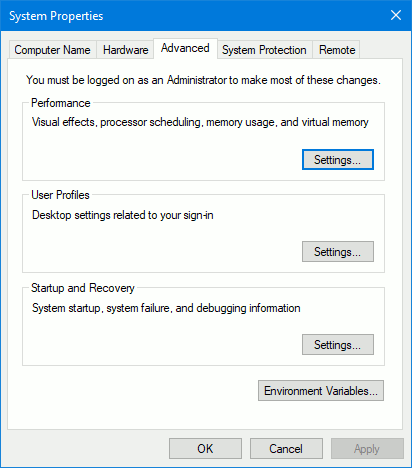

You have two main options in how you want to build Julius. You can either:

* [Build using **Microsoft Visual Studio**](#a-using-microsoft-visual-studio-64-bit-build); or
* [Install CMake and MinGW-w64 and **use the command line**](#b-using-cmake-and-mingw-w64-via-command-line)

## A. Using Microsoft Visual Studio (64-bit build)

1. Make sure you have [Microsoft Visual Studio](https://visualstudio.microsoft.com/vs/) installed.
   Please note that only Visual Studio 2017 (fully updated) or Visual Studio 2019 can be directly used.
   You need to have `C++ CMake tools for Windows` installed for Visual Studio that you can install via
   Visual Studio Installer as an optional package.
   These instructions assume you are using Visual Studio 2019.

2. Download the `SDL2` development library as a zip file:

	* Open the [SDL2 download page](https://www.libsdl.org/download-2.0.php)
    * In the section `Development Libraries`, select `SDL2-devel-2.0.12-VC.zip (Visual C++ 32/64-bit)`

3. Download the `SDL2_mixer` development library as a zip file:

	* Open the [SDL2_mixer download page](https://www.libsdl.org/projects/SDL_mixer/)
    * In the section `Development Libraries`, select `SDL2_mixer-devel-2.0.4-VC.zip (Visual C++ 32/64-bit)`

4. Open Microsoft Visual Studio. Select `Clone or check out code`.

 	

5. In the `Repository location` option, type `https://github.com/bvschaik/julius.git`.
   In the `Local path` option, select in which folder you wish the source to be downloaded to.
   This will be your `<work folder>`:

    

    Alternatively, you can obtain the source code without using Visual Studio's built in Git
    integration. Check [obtaining the source files for Julius](#obtaining-the-source-files-for-julius)
    for details.

6. The first time you open the project, Visual Studio will throw an error complaining it can't
   find SDL:

	

7. You will need to extract the SDL libraries you already downloaded to a specific directory. To do so, extract the `SDL2` and `SDL2_mixer` development libraries you already downloaded to `<work folder>\ext\SDL2`.

    If you extracted the libraries to the correct place, your `<work folder>\ext\SDL2` should look like this:

    

8. After extracting the files, on Visual Studio, go to `Project → Generate Cache for julius`. The build configuration should complete successfully and the error should disappear.

9. Pick `Select Startup Item` up top and select `julius.exe`.

	

10. Go to `Build → Build All`. The game should compile without errors.

11. After the game compiles, it is stored in a folder inside your `<work folder>`. You can access
    it from `<work folder>\out\build\x64-Debug`.

12. If you simply execute the game right now, it will complain about missing DLL's. You need
    to copy the `SDL2` and `SDL2_mixer` DLL's to the same directory as the executable.

	Both libraries are available inside your library directory. Using the example library
    location, the files should be in the following location:

	* `SDL2` - `<work folder>\SDL2-2.0.12\lib\x64`
	* `SDL2_mixer` - `<work folder>\SDL2_mixer-2.0.4\lib\x64`

**Success!** You should now be able to run the game.

## B. Using CMake and MinGW-w64 via command line

Building Julius by command line is useful if you don't wish to install a very large IDE
such as Visual Studio. However, it still requires that you install some programs, such as CMake,
MinGW-w64 and optionally Git.

### Installing the prerequesite programs

#### Installing MinGW-w64

MinGW stands for *Minimalist GNU for Windows* and is a set of programs and tools that allow
the compilation of the source files to an executable.

In order to properly install MinGW-64, do the following:

1. Obtain [MinGW-w64](https://sourceforge.net/projects/mingw-w64/files/Toolchains%20targetting%20Win32/Personal%20Builds/mingw-builds/installer/mingw-w64-install.exe) and proceed to install it.
   The default options are good enough.

2. Add the MinGW-w64 binaries to the `path`:

    * In the start menu, type `environment variables` and select `Edit the system
      environment variables`.
    * In the new window that appears, select `Environment Variables`:

        

    * On the new window that appears, at the top list, select the `Path` variable and
      click `Edit`.
    * On the new window that appears, select `New` and type
      `C:\Program Files (x86)\mingw-w64\i686-8.1.0-posix-dwarf-rt_v6-rev0\mingw32\bin`.
    * Click `OK` on all windows to confirm.

        

3. MinGW-w64 is now installed.

#### Installing CMake

CMake is the tool that tells MinGW-w64 which files to compile and what options to use.

Open the [download page for CMake](https://cmake.org/download/) and select the file from
the `Windows win64-x64 Installer` option to install.

During install, check the option `Add CMake to the system PATH for the current user`:

#### Installing Git for Windows (optional)

Git is a source control system, allowing the local source code to be updated by only downloading
the relevant changes instead of the entire codebase. This program is optional.

If you wish to install it, [download it from the `gitforwindows` website](https://gitforwindows.org),
which provides an user interface as well as the command line tools. The default installation
options are enough for Julius.

### Obtaining the source files for Julius

You have two options regarding on how to obtain the source code for Julius.
The simplest, but not recommended one, is [downloading the `julius` repository as a zip file](https://github.com/bvschaik/julius/archive/master.zip).

While doing this will work, you will have to download the entire source again if there are
any updates to the game which you wish to build yourself. So only directly download the
source if you're sure you want to do it just once.

Still, if you download the contents as a zip file, extract them to a folder, which will be
your `<work folder>`. You can now proceed to [build Julius](#building-julius).

The best approach, however, is to use Git for Windows, since it allows you to keep up with
changes to the source code.

If you followed the optional section about installing Git, keep reading. If not, follow
[installing Git for Windows](#installing-git-for-windows-optional) before proceeding.

To obtain the source from Git, follow the following steps:

1. Press `Shift` and right-click with the mouse on the folder where you wish to download
   the source to.

2. Select `Open PowerShell window here` or `Open command window here`.

3. On the command window, type:

        > git clone https://github.com/bvschaik/julius.git

4. The source files will be downloaded to a folder called `julius` inside the folder where you ran the command. That `julius` folder will be referred to as `<work folder>`.

**Optional:** If you already have the source files from Git and simply wish to update them
(in order to build a newer version), repeat above steps 1. and 2. and type:

        > git pull origin master

Then, assuming you have already obtained the `SDL2` and `SDL2_mixer` libraries and added them to the `ext` folder, if you wish to proceed building Julius, delete the `build` folder and proceed to
[build Julius](#building-julius) normally.

### Obtaining SDL2 and SDL2_mixer

1. Download the `SDL2` development library as a gzipped file:

	* Open the [SDL2 download page](https://www.libsdl.org/download-2.0.php)
    * In the section `Development Libraries`, select `SDL2-devel-2.0.12-mingw.tar.gz (MinGW 32/64-bit)`

2. Download the `SDL2_mixer` development library as a gzipped file:

	* Open the [SDL2_mixer download page](https://www.libsdl.org/projects/SDL_mixer/)
    * In the section `Development Libraries`, select `SDL2_mixer-devel-2.0.4-mingw.tar.gz (MinGW 32/64-bit)`

3. Extract the `SDL2` and `SDL2_mixer` development libraries to `<work folder>\ext\SDL2`.

    * If you can't extract `.tar.gz` files, [obtain 7-Zip](https://www.7-zip.org/).
    * For each one of the downloaded libraries, after opening the `.gz` file in 7-Zip, open the
      single `.tar` file that appears on the 7-Zip window and extract its contents:

        

4. If everything went correctly, your `<work folder>\ext\SDL2` should look like this:

    

### Building Julius

1. Open the folder where you downloaded the source files to.

2. Press `Shift` and right-click with the mouse on the `julius` folder and select
   `Open PowerShell window here` or `Open command window here`.

3. Create a `build` directory and move to it:

        > mkdir build
        > cd build

4. Run `cmake`:

        > cmake .. -G "MinGW Makefiles" 

5. Build Julius:

        > mingw32-make

    The game will be built to the `build` directory inside the main folder.

6. Test that everything is working:

        > mingw32-make test

7. If you simply execute the game right now, it will complain about missing DLL's. You need to
   copy the `SDL2` and `SDL2_mixer` DLL's to the same directory as the executable.

	Both libraries are available inside your library directory. Using the example library
    location, the files should be in the following location:

	* `SDL2` - `<work folder>\ext\SDL2\SDL2-2.0.12\i686-w64-mingw32\bin`
	* `SDL2_mixer` - `<work folder>\ext\SDL2\SDL2_mixer-2.0.4\i686-w64-mingw32\bin`

**Success!** You should now be able to run the game.
