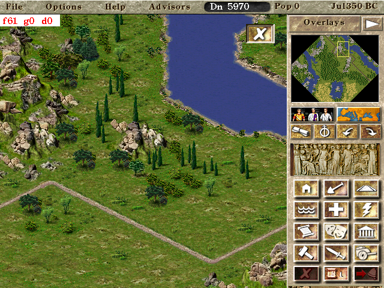
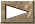

# Touch usage

Since Android devices generally rely on touch input, Julius has fully dedicated touch support.
For the most part using touch in Julius should be fairly intuitive. However, the original game
being more than twenty years old, some thought needed to be given to how construction would work
and menus would be navigated.

Therefore, this page is a comprehensive manual for using touch with Julius.

## Basic touch features in the menus

A single finger is equivalent to mouse usage in most menus. You can tap any menu with one finger
and it will behave as a left mouse click.

To exit most menus you can do one of two things:

1. Double-tap outside the menu

2. Press and hold with a finger, tap outside the menu with a second finger

You can scroll menus that have scrollbars by touching and dragging with two fingers.

To view a tooltip, press and hold on the place you want to see the tooltip.

## Navigate through the city using touch

To scroll the map, you can press and drag with a single finger. This also works for the empire map.

To view a tile information, make sure no construction is active then tap the tile. You can then
double-tap to exit the information window.

## Constructing the city using touch

There are two types of construction: some can be click-dragged, others cannot (they are single
buildings). Examples of constructions that can be click-dragged: roads, houses, walls, reservoirs,
clear land.

There are different (but somewhat similar) ways to build a simple and a click-draggable construction.

1. For simple builings: tap anywhere on the map to show the ghost. Tap again on the ghost to confirm
   construction or somewhere else to move the ghost. If you press-drag, the building ghost will move
   with your finger.

2. For click-draggable buildings: Press to set the starting position. You can then either drag the
   finger to extend the construction range, or immediately lift the finger and tap somewhere else to
   extend the construction range. To confirm the construction, tap at the end of the range (the tile
   you last released the finger at).

    If you are not happy with the construction range, instead of confirming it as said above, you
    can do either of the following:

    - Press and drag at the end of the range to change the end of the range

    - Tap somewhere else to set the end of the range to that spot

    - Press and drag somewhere else to restart the construction range from the pressed spot

When either type of construction is active, you cannot scroll the city normally. To scroll when in
construction mode you need to press-drag next to the edges of the screen. The closer to the edge
your finger is, the faster the scroll will be.

### Cancelling a build

Every time you select something to construct when using touch, a "cancel button" build will appear
like on the image above.

If you are placing a simple building, clicking the button will immediately exit construction mode.

If you are in the middle of placing a "click-draggable building" (i.e. you've set the start point
but you haven't yet confirmed the end point), clicking the button will cancel the pending
"click-draggable" construction but not exit construction mode. For that, you must press the button
again.

As an alternative to pressing the button, you can press and hold with a finger and tap with a second
finger to cancel the build. Both options work exactly the same way.

## Military mode

In order for military mode to be used with touch,
[enabling the military sidebar](Configuration#enable-military-sidebar) is strongly recommended as
it's the only available feedback for displaying when a military unit is active.

Military works more or less like using the mouse. Tap on a military unit to select it and tap on a
point on the map to set its destination. You can press and drag on the map to scroll it.

To exit the military mode without moving a legion, tap the
 button on the sidebar.

## Using the map editor

The map editor works exactly the same way as normal city construction when creating buildings or
roads.
For map points, the game works like creating a simple building.
For tiles that use a brush, a simple press-drag and drag will immediately apply the terrain change
without having to confirm by clicking again.

## Final notes

Touch actions override mouse actions. If you are touching the screen and moving the mouse, the mouse
cursor will not move.
In the city window, if nothing is being built, you can drag the finger to scroll the map. This also
works for the empire view.
